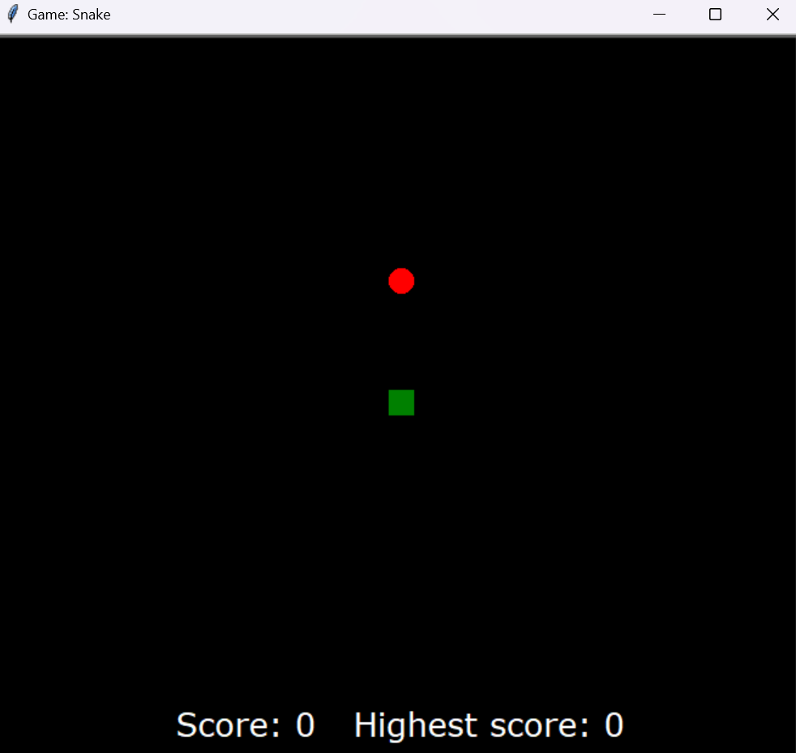

# Snake Game

A simple Snake game implemented in Python using the Turtle graphics library.

## Description

This is a classic Snake game where the player controls a snake that moves around the screen, eating food to grow longer. The game includes multiple difficulty levels and keeps track of the player's score and highest score.

## Features

- Snake movement in four directions: up, down, left, and right.
- Randomly generated food for the snake to eat.
- Three difficulty levels: Easy, Medium, and Hard.
- Game Over screen with the option to start a new game.
- Score tracking with highest score display.

## Getting Started

### Prerequisites

You need to have Python installed on your machine to run this game.

### Installation

1. Clone this repository:

   ```bash
   git clone https://github.com/your-username/snake-game.git

2. Navigate to the project directory:

    ```bash
   cd snake-game
   
### Usage:

1. Run the game:
   ```bash
   python snake_game.py

3. Choose a difficulty level by clicking on the respective button.
4. Use the arrow keys to control the snake's movement.
5. Eat the red food to grow the snake and increase your score.
6. The game ends if the snake collides with the wall or itself. You can start a new game by clicking the "New Game" button.

Enjoy the game!!

### Screenshots:




  
